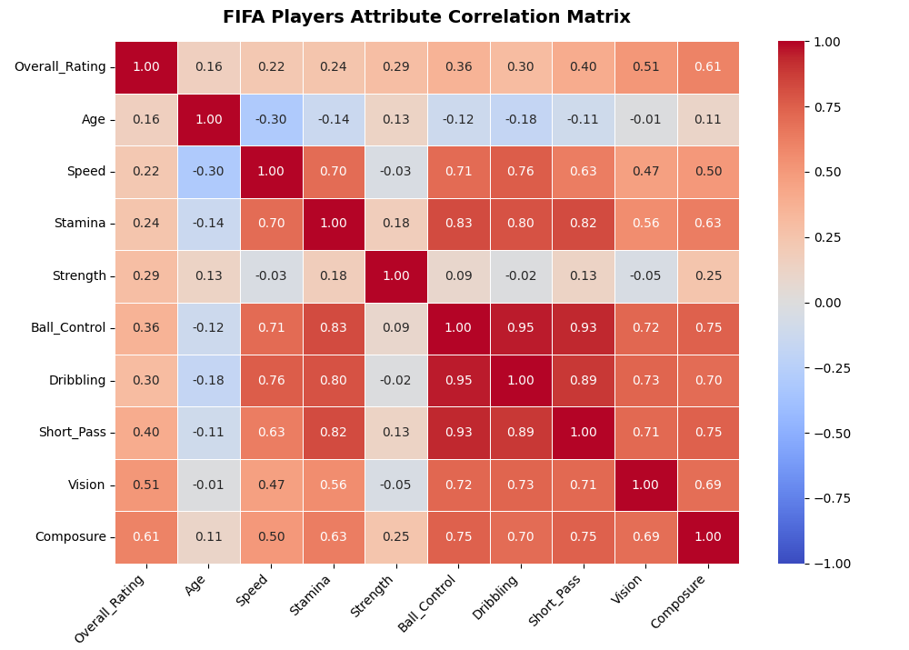

# FIFA Players Performance & Analytics System

An interactive Python command-line data application that processes, cleans, and performs advanced statistical profiling on a dataset of over 1,000 professional football players. This project transforms a legacy spreadsheet structure into a scalable data pipelines environment, implementing advanced feature engineering and data visualization.

---

## 🚀 Key Features

*   **Data Pipeline & Pipeline Standardization:** Automatic ingestion and structural transformation of local localized datasets into an international English schema using Pandas.
*   **Descriptive Statistical Profiling:** Automated generation of data distributions across core physical and technical traits.
*   **Advanced Aggregations & Pivot Dynamics:** Cross-examination of player capabilities mapped by club affiliation and preferred foot metrics.
*   **Custom Feature Engineering:** Algorithmic categorization of player datasets into tactical archetypes based on multivariate spatial and physical attributes.
*   **Exploratory Multivariate Visualizations:** Generation of clean Pearson correlation matrices using Seaborn and Matplotlib to analyze performance drivers.
*   **Cross-Platform Architecture:** A resilient CLI environment designed natively to operate seamlessly across Windows, Linux, and macOS platforms.

---

## 📊 Analytical Insights & Findings

### 1. Feature Engineering Distribution
The script applies customized logical segmentations to dynamically isolate specific player profiles from raw spatial and technical data. The data architecture populates the following archetypes across the sample:
*   **Playmakers:** Characterized by high field vision and short-passing mechanics.
*   **Agile Wingers:** Isolated by matching speed thresholds alongside high-tier dribbling controls.
*   **Defensive Anchors:** Mapped by raw structural physical strength and high standing-tackle metrics.

### 2. Physical vs. Technical Trade-Offs
Through the automated statistical summary (`.describe()`), data patterns reveal standard physical variances. While metrics such as overall ratings cluster compactly around a steady mean, velocity arrays show a high standard deviation—scientifically proving clear structural variances between high-speed profiles and rigid defensive frames.

---

## 🛠️ Tech Stack & Architecture

*   **Language:** Python 3.10+
*   **Data Libraries:** Pandas, NumPy
*   **Visualization Engines:** Matplotlib, Seaborn
*   **Environment Systems:** Native Command Line Interface (CLI) / OS Modules

---

## 📦 Project Structure

```text
├── Datos Jugadores FIFA.xlsx  # Core localized spreadsheet dataset (Raw Data)
├── main.py                    # Principal analytical system and interactive engine
└── README.md                  # System documentation and portfolio profiles
```

---

## ⚙️ Setup and Installation

1. Clone this repository into your environment:
   ```bash
   git clone https://github.com/GabrielAdrian03/fifa-player-analytics.git
   cd fifa-player-analytics
   ```

2. Install the necessary engineering and data visualization packages:
   ```bash
   pip install pandas openpyxl matplotlib seaborn
   ```

3. Ensure the core raw dataset file `Datos Jugadores FIFA.xlsx` is placed directly within the root folder directory.

4. Run the interactive analytical software:
   ```bash
   python jugadores_fifa.py
   ```


---

## 📬 Contact & Technical Profile

*   **Developer:** Gabriel Adrian González
*   **Role:** Software Developer & Data Science Specialist
*   **Focus Area:** Industrial Data Systems, Operations Optimization & Data Architecture
*   **Location:** Argentina (Open to International Relocation & Remote Contracts)
*   **LinkedIn:** https://www.linkedin.com/in/adrian-gonzalez-705347155
*   **GitHub Portfolio:** https://github.com/GabrielAdrian03

